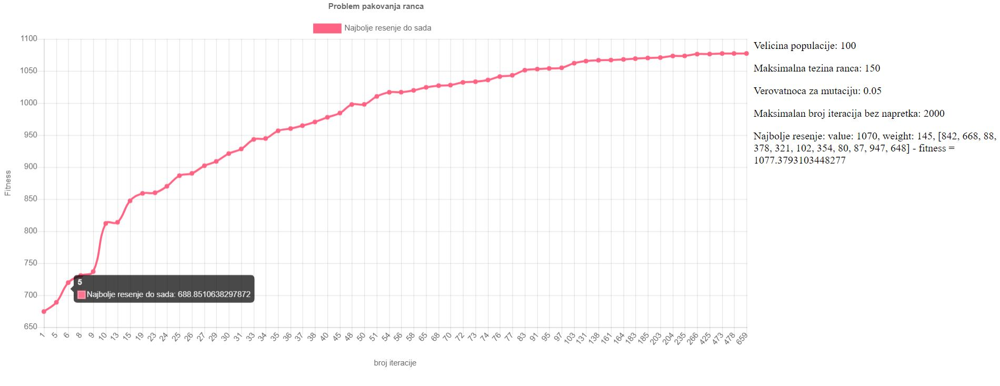

# Knapsack problem using genetic algorithm
1. [Introduction](#introduction)
2. [Parameters](#paragraph1)
3. [Results](#paragraph2)

## Introduction 
Genetic algorithm implementation for solving knapsack problem.

## Parameters 
Program can be parameterized with the following options:
* MAX_WEIGHT - maximum weight of the knapsack
* POPULATION_SIZE - number of solutions in a generation
* MUTATION_PROBABILITY - e.g. 0.05;
* MAX_INTERATIONS_WITHOUT_PROGRESS - when to conclude the search, e.g. after 2000 iterations without making progress

Feel free to experiment with parameters and observe the results.

## Results 
After completion, program generates chart.html which shows the progress through time as well as result details.

